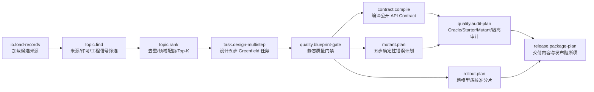

# Terminal Data Factory：算子式 Data Infra v1

这套 infra 把 Terminal-Bench 数据生产拆成可组合算子。每个算子只做一件事，
声明输入/输出 artifact 类型和版本；运行时负责内容寻址、血缘、缓存、原子落盘
和可复现 run ledger。

它不是“一个 prompt 批量生成 10,000 道题”。它把便宜的确定性检查前置，只让
通过 Topic、契约和质量门禁的候选进入昂贵的代码合成、Harbor 审计与模型 rollout。

## 已实现的端到端控制平面



当前 10 个控制平面算子可直接运行。代码合成、verifier 生成、Harbor 执行、
目标模型 rollout 执行属于 worker 层；v1 已定义它们的输入计划和验收 artifact，
下一阶段应接入模型服务与 Harbor，而不把 API key 或执行逻辑写入算子 DAG。

## 快速运行

在项目根目录执行：

```bash
PYTHONPATH=src python3 -m terminal_data_factory.cli operator-list

PYTHONPATH=src python3 -m terminal_data_factory.cli pipeline-run \
  --spec data_infra_v1/pipelines/topic_to_calibration.json \
  --work-dir /tmp/tdf-operator-run
```

再次运行同一命令，10 个节点应全部命中缓存。查看任一输出：

```bash
PYTHONPATH=src python3 -m terminal_data_factory.cli artifact-show \
  --work-dir /tmp/tdf-operator-run \
  --digest <run.json 中的 digest>
```

运行目录结构：

```text
<work-dir>/
├── artifacts/<前两位>/<sha256>.json   # 不可变、内容寻址 artifact
├── cache/<operator-cache-key>.json    # 节点输出索引
└── runs/<run-id>/run.json             # DAG、输入、输出、版本、缓存命中
```

样例输入故意包含一个合格 Topic 和一个无来源/许可的坏候选。预期结果：

- Topic candidates：1；
- Topic rejections：1；
- accepted blueprints：1；
- mutants：5，覆盖 Step 1–5；
- rollout jobs：6（两个模型族，各三次）；
- package plans：1，并保持 `full-calibration-required` 阻断标签。

## 算子契约

一个算子必须满足：

1. 名称和版本固定，例如 `topic.find@1.0`；
2. 输入、输出 artifact 类型显式声明；
3. 同样的版本、配置和输入 digest 产生相同输出；
4. 不读取未声明的上游状态；
5. 不在 artifact、日志或 pipeline 中保存 API key；
6. 外部副作用使用幂等 job id，由 worker 执行并返回证据 artifact；
7. 质量失败产生结构化 rejection，不静默降级。

Artifact digest 覆盖类型、版本、生产者、父 artifact 和数据。读取时重新计算哈希，
所以手工篡改会被拒绝。

## 与当前 10 条高质量 Demo 的关系

这套 infra 吸收了当前 10 条数据审查中暴露的问题：

- 强制来源和许可，不接受无血缘候选；
- 强制五步公开 API 与 smoke case，避免接口猜测地板；
- 强制 Step 1–5 的确定性 mutant，避免漏测最终奖励；
- final Step 必须回归前序能力；
- 主奖励计划固定为严格二值，辅助分单独记录；
- rollout 至少包含两个模型族；
- package plan 不会把“静态质量通过”误标成“难度已校准”。

完整算子说明见 [OPERATOR_CATALOG.md](OPERATOR_CATALOG.md)，规模化方案见
[SCALING_PLAN.md](SCALING_PLAN.md)。
